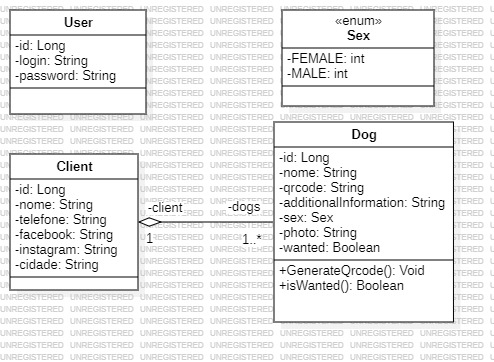

<!DOCTYPE html>
<html>
<body>

<h1 align="center">Pet-Fi</h1>

<h3 align="center">Aplicação para gerar um cadastro do pet na venda de uma coleira, possibilitando gerar um QR code para ser impresso na coleira com os dados.</h3>

 

  <a href="#">//TODO link app</a>

 

  Login: admin / Senha: admin
   

 

  

      
<strong>Requisitos</strong>

       
      

        

          
<strong>Requisitos do Sistema</strong>

           
          <ul>
          

            Privado:
             
            <li>Ter um usuário/senha para logar no sistema.
            </li>
            <li>Realizar cadastro com os dados do pet/dono e armazenar em um banco de dados.
            </li>
            <li>Possibilidade de atualizar, deletar os dados caso necessário.
            </li>
            <li>Buscar os pets cadastrados.
            </li>
             
            Publico:
             
            <li>Buscar todos pets cadastrados.
            </li>
            <li>Localizar o pet escaneando o QR code na coleira.
            </li>
            <li>Publicidade da loja que vende a coleira.
            </li>
             
          

          </ul>
        

      

      

        

          
<strong>Casos de uso</strong>

        

        

        

          
<strong>Privado</strong>

           
          

          Login/logout do sistema.
          <ul>
            <li>Usuário tenta acessar o sistema.
            <ol><u>Entrada esperada:</u></ol>
            <ol>-Login/senha válidos, registrados no banco de dados.</ol>
            </li>
            <ol><u>Saída esperada:</u></ol>
            <ol>-Acesso a tela home/privada para cadastrar/localizar pets, em caso login e/ou senha válidos.</ol>
            <ol>-Impedir o acesso caso login e/ou senha inválidos, exibir mensagem de erro.</ol>
          </ul>
          CRUD do sistema.
          <ul>
            <li>Página home: registrar, buscar, alterar e excluir dados de um pet/dono no banco de dados.
            <ol><u>Entrada esperada:</u></ol>
            <ol>-Pet: id, nome, qr code, informacões adicionais, sexo, foto, procurado
            </ol>
            <ol>-Cliente: id, nome, telefone, facebook, instagram, cidade </ol>
            <ol><u>Saída esperada:</u>
            </ol>
            <ol>-Registro/atualização de um pet no sistema.</ol>
            <ol>-Registro/atualização de um cliente sistema.
            </ol>
            <ol>-Dados de um pet localizado pelo campo selecionado na pesquisa.</ol>
            <ol>-Lista com todos os pets em sistema.</ol>
            </li>
            <li>Página home: gerador de qr code, possibilidade de download do qrcode para impressão em coleiras.
            <ol><u>Entrada esperada:</u></ol>
            <ol>-Pet: id </ol>
            <ol><u>Saída esperada:</u></ol>
            <ol>-Url com qr code do pet requisitado pelo id. </ol>
            <li>Página home: possibilidade de alterar o atributo "procurado" do pet através de um flag booleano.
            <ol><u>Entrada esperada:</u></ol>
            <ol>-Pet: id </ol>
            <ol><u>Saída esperada:</u></ol>
            <ol>-Procurado = true/false </ol>
            </li>
          </ul>
          

        

      

      

        

          
<strong>Público</strong>

           
          

          Acesso a home/pública via qr code.
          <ul>
            <li>
            Usuário escaneou o qr code na coleira.
            <ol><u>Entrada esperada:</u></ol>
            <ol>-Url home/pública com id do pet.</ol>
            <ol><u>Saída esperada:</u></ol>
            <ol>-Todos os dados registrados no banco de dados do pet selecionado.</ol>
            </li>
          </ul>
          Buscar todos os pets em sistema.
          <ul>
            <li>Usuário não sabe/conseguiu ler o qr code.
            <ol><u>Entrada esperada:</u></ol>
            <ol>Acesso a página home/pública.</ol>
            <ol>Busca de pet por código de identificação.</ol>
            <ol>Filtro de pets por cidade</ol>
            <ol>Flag do atributo "procurado" em true/false</ol>
            <ol><u>Saída esperada:</u></ol>
            <ol>-Lista com todos os pets em cadastrados no banco de dados do sistema, filtrados ou não.</ol>
            <ol>-Dados de um pet localizado por id.</ol>
            </li>
          </ul>
          

        

      

    

   

  

 

  

    
<strong>App Roadmap</strong>

    

       
      
      
      
- Back-End:

      Task 1 : CRUD de sistema, relacionamentos entre entidades.
      <ul>
        <li><s>Configuração com banco de dados H2 para testes, profile TEST</s></li>
        <li><s>Criação das entidades e mapeamento Hibernate</s></li>
        <li>Validações com Spring Validation.</li>
        <li><s>Criação de todos controllers, pelo menos com o método "find" para testar relacionamentos.
        </s></li>
        <li><s>Database seeding para testes.</s>
        </li>
        <li><s>Controller/Service com CRUD completo para entidades user, pet, cliente.</s>
        <li><s>Camada DTO</s></li>
        </li>
        <li><s>Exceptions configuradas.</s>
       </li>
        <li><s>Upload de foto de perfil do pet, salvando no banco de dados.</s>
        </li>
        <li><s>Geração de link url para qr code.</s></li>
        <li><s>Configuração e testes com banco de dados postgreSQL / profile DEV</s></li>
      </ul>
      Task 2 - Spring security, autenticando o sistema e autorizando páginas de acordo com o perfil.
      <ul>
        <li><s>Validação com banco de dados, login/senha para acessar o sistema.</s>
        </li>
        <li><s>Validação para não acessar página home/privada sem estar logado.</s>
        </li>
      </ul>
      
- Front-End:

       <ul>
        <li><s>Configuração Material Design for Bootstrap 5 & Angular 17.</s></li>
        <li><s>Criação front com angular.</s></li>
        <li><s>Criação modelds.</s></li>
        <li><s>Criação services.</s></li>
        <li><s>Criação layouts básicos.</s></li>
        <li><s>Página admin/home - crud completo cliente.</s></li>
        <li><s>Página admin/home - crud completo pet.</s></li>
        <li><s>Página admin/home - geração de qrcode.</s></li>
        <li><s>Página admin/home - listando todos os pets, com recurso para atualizar/excluir em cada pet.</s></li>
        <li><s>Página admin/home buscando pet, filtrados por nome, código.</s></li>    
        <li><s>Ao ser encaminhado pelo qr code escaneado, página com dados pet/cliente.</s></li>      
      </ul>
      
      
    

  

 

  

    
<strong>UML</strong>

     
    

    
    

    

 

  

    
<strong>Imagens</strong>

     
    

     
    

    

 

  <h3>Tecnologias utilizadas</h3>
  
Java, Spring Boot, Angular, Bootstrap, PostgreSQL, Git e Github.

